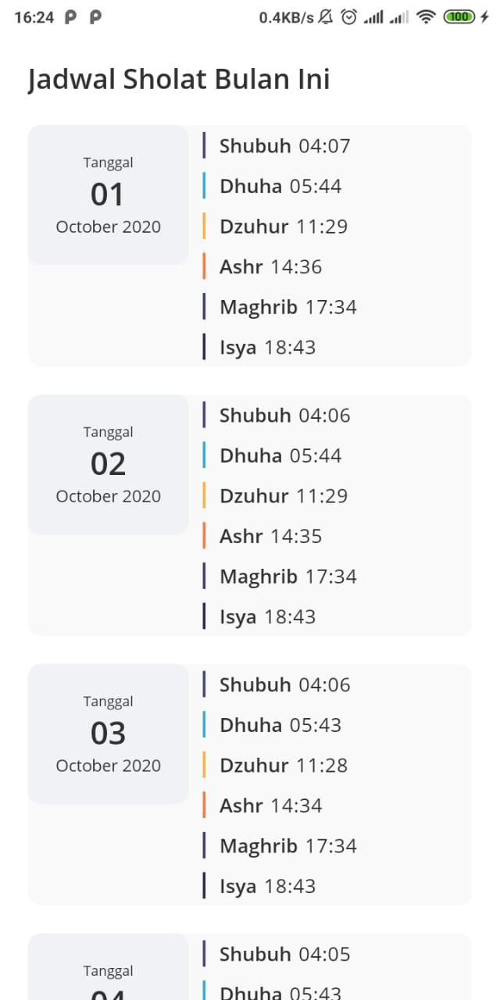
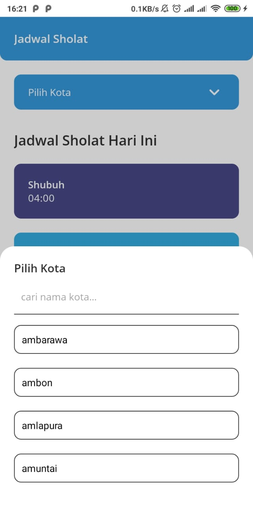
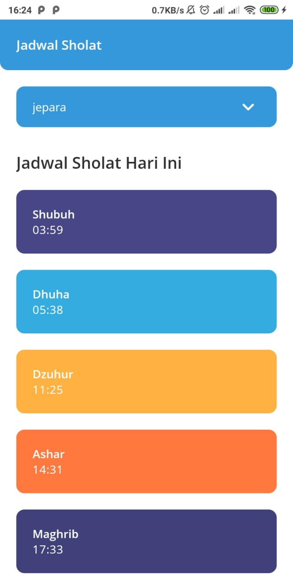

# Jadwal Sholat APP React Native

# Installation
- git clone https://github.com/nahansans/jadwal_sholat.git
- npm install
- npx react-native run-android

# generate apk
- cd android
- gradlew assembleRelease
